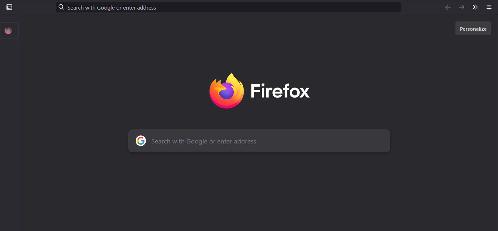

# Simple Firefox Theme
## introduction

Just a simple Firefox theme forks from [FlyingFox](https://github.com/akshat46/FlyingFox).  After the update of Firefox 89, the theme seems to be a little wired at some place. So I modify it to meet my need. Only get rid of titlebar,back-button,forward-button and hover sidebar.
## installation
> You can find the instruction on [FlyingFox Wiki](https://github.com/akshat46/FlyingFox/wiki).

1. For short, Copying entire repository into profile directory. You can find the directory by typing `about:profiles` at address bar.
2. Copying `ExtensionSlidebar.css` into "Tree Style Tab - Option - Advanced".